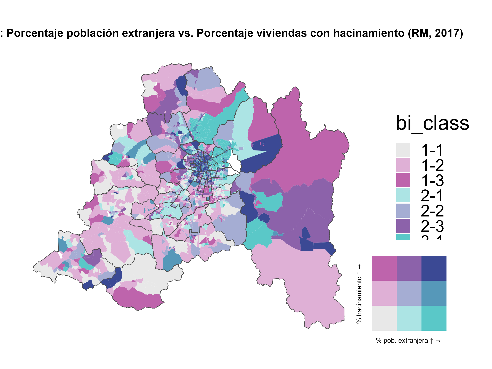

# 1. Introducción

En Chile las ciudades se han vuelto un reflejo de la desigualdad social, económica y territorial que se genera. La Región Metropolitana concentra gran cantidad de población de todo el país, siendo a su vez un centro en el cual coexisten diferentes barrios con diferentes estandares de vida, teniendo así mismo sectores más precarios caracterizados por la crisis habitacional, hacinamiento y pobreza.

Durante las ultimas dos décadas el fenómeno migratorio a su vez ha explotado exponencialmente, transformando así en gran manera lo que es la composición demografica en todas las regiones. Esto implica la llegada de miles de familias en busca de oportunidades, pudiendo establecerse inicialmente en zonas urbanas con menores costos, esto ha generado nuevas dinámicas en el territorio, visibilizando tambien las grandes problematicas a nivel de vivienda, acceso a servicios y condiciones de habitabilidad.

El hacinamiento se entiende como la **cantidad excesiva de personas por dormitorio dentro de una vivienda**, en Chile se considera una situación de hacinamiento el que ocupen una misma habitación para dormir más de 2 personas. Cuando se tiene en cuenta este criterio es posible que se evidencie que gran parte de la zona central se encuentra en esta situación.\
\
El presente trabajo tiene como objetivo **analizar la distribución territorial del hacinamiento y la población inmigrante en la Región Metropolitana de Santiago**, utilizando información proveniente del **Censo 2017** y representando ambos indicadores mediante un **mapa bivariado**.

## 1.1 Objetivo General

***Analizar la relación espacial entre el hacinamiento habitacional y la población inmigrante en la Región Metropolitana de Santiago a nivel de zona censal urbana.***

## 1.2 Objetivos específicos

-   **Calcular** el porcentaje de viviendas con hacinamiento moderado o crítico.

-   **Identificar** zonas donde se superponen altas tasas de hacinamiento y presencia de población extranjera.

-   **Estimar** el porcentaje de población inmigrante residente en cada zona censal urbana.

-   **Representar** ambos indicadores mediante mapas temáticos y bivariados.

# 2. Metodología

## 2.1 Librerias y conexión a base de datos

Bloque inicial del codigo destinado a la exportación de las librerias a utilizar, entre las cuales destaca principalmente la libreria **(sf)** que tiene como objetivo el gestionar geometrías espaciales y así mismo **(ggplot2)** para visualizar gráficas.

```{r Librerias}
library(DBI) 
library(RPostgres)
library(sf) 
library(ggplot2) 
library(RColorBrewer)
library(cowplot) 
library(biscale)
```

Segunda parte del bloque inicial, destinado a generar la conexión a la Base de Datos de PostgreSQL. A través de este bloque de codigo se entregan las credenciales necesarias para generar la conexión para posteriormente trabajar a partir de dicha base de datos.

```{r Conexión a Base de Datos}

db_host = "localhost"
db_port = 5432
db_name = "censo_rm_2017"
db_user = "postgres"
db_password = "lucho98"

# Conexión
con = dbConnect(
  Postgres(),
  dbname   = db_name,
  host     = db_host,
  port     = db_port,
  user     = db_user,
  password = db_password
)
```

## 2.2 Variables utilizadas

Para el desarrollo de este trabajo se utilizaron las variables obtenidas del Censo 2017, para este caso en que el enfoque es relacionado a la migración y el hacinamiento, las variables a considerar son:

-   **p12**: País de nacimiento (Valores diferentes a los correspondientes a nacionalidad Chilena y a valor desconocido )

-   **ind_hacin_rec** : Indicador censal de hacinamiento ( Valor \>= 2 corresponde a hacinamiento)

-   **z.geocodigo** : Identificador único de zona censal

-   **c.nom_comuna** : Nombre de las comunas

## 2.3 Consultas SQL

En este bloque se destino a la creación de los indicadores a través de los cuales se calcularan los porcentajes de hacinamiento y de extranjeros para su posterior cruce en un mapa bivariado. Este codigo muestra las conexiones que se hicieron desde las tablas de personas, viviendas, hogares y geometrías del censo, a través de lo cual se puede evidenciar como se realizaron los distintos calculos

```{r Creación de Indicadores SQL}
sql_indicadores = "

WITH agg AS (

    SELECT 
        z.geocodigo::double precision AS geocodigo,
        c.nom_comuna,

        -- % población extranjera
        ROUND(
            COUNT(*) FILTER (WHERE p.p12 NOT IN (1, 2, 98, 99)) * 100.0 / COUNT(*), 
            2
        ) AS ptje_extranjeros,

        -- % viviendas con hacinamiento (categorías 2 o 3)
        ROUND(
            COUNT(*) FILTER (
              WHERE v.ind_hacin_rec >= 2 AND v.ind_hacin_rec NOT IN (98, 99)
              ) * 100.0 /
              COUNT(*) FILTER (WHERE v.ind_hacin_rec NOT IN (98, 99)),
              2
         ) AS ptje_hacinamiento

    FROM public.personas   AS p
    JOIN public.hogares    AS h ON p.hogar_ref_id    = h.hogar_ref_id
    JOIN public.viviendas  AS v ON h.vivienda_ref_id = v.vivienda_ref_id
    JOIN public.zonas      AS z ON v.zonaloc_ref_id  = z.zonaloc_ref_id
    JOIN public.comunas    AS c ON z.codigo_comuna   = c.codigo_comuna
    JOIN public.provincias AS pr ON pr.provincia_ref_id = c.provincia_ref_id

    GROUP BY z.geocodigo, c.nom_comuna

```

Segunda parte corresponde a la extracción de las variables de geometría que corresponden a la zona de la Región Metropolitana

```{r}

SELECT 
    a.geocodigo,
    shp.geom,
    a.nom_comuna,
    a.ptje_extranjeros,
    a.ptje_hacinamiento
FROM agg AS a
JOIN dpa.zonas_censales_rm AS shp ON shp.geocodigo = a.geocodigo;

"

# Almacenar resultado en R como objeto sf
df_indicadores = st_read(con, query = sql_indicadores)


########################
### 4) Marco comunal ###
########################

sql_comunas = "
SELECT nom_comuna, geom
FROM dpa.comunas_rm_shp;
"

sf_comunas = st_read(con, query = sql_comunas)
```

## Formula de indicadores:

-   ***% Extranjeros:*** Corresponde a la proporción de personas nacidas fuera de Chile que residen en el. Para su cálculo se utilizó la variable de **p12 (País de nacimiento)** considerando como población extranjera quienes declararon valores diferentes a : 1, 2, 98, 99

    

-   ***% Hacinamiento:*** presenta la proporción de viviendas que presentan condiciones de hacinamiento medio o crítico respecto del total de viviendas de la zona censal. Para ello se utilizo la variable **ind_hacin_rec** en donde se consideraron los valores: **2 y 3, excluyendo 98 y 99.**

    

# 3. Resultados

## 3.1 Mapa de hacinamiento

Como se solicito en la pauta inicialmente, se generaron individualmente mapas de distribució de las variables sobre la RM. Para ello se utilizo el siguiente codigo para la generar dicho mapa de hacinamiento:

```{Mapa Hacinamiento}
mapa_hacinamiento <- ggplot() +
  geom_sf(data = df_indicadores, aes(fill = ptje_hacinamiento), color = NA) +
  geom_sf(data = sf_comunas, fill = NA, color = "grey40", linewidth = 0.3) +
  scale_fill_viridis_c(
    option = "plasma",
    direction = -1,
    name = "% viviendas con hacinamiento"
  ) +
  labs(title = "Distribución del hacinamiento - RM (2017)") +
  theme_minimal() +
  theme(
    plot.title = element_text(face = "bold", size = 13, hjust = 0.5),
    legend.position = "right",
    axis.text = element_blank(),
    axis.ticks = element_blank(),
    panel.grid = element_line(color = "grey90", linewidth = 0.3)
  )


```

## 3.2 Mapa de migración

```{r Mapa migracion}
# 1️⃣ Mapa: % población extranjera
mapa_extranjeros <- ggplot() +
  geom_sf(data = df_indicadores, aes(fill = ptje_extranjeros), color = NA) +
  geom_sf(data = sf_comunas, fill = NA, color = "grey40", linewidth = 0.3) +
  scale_fill_viridis_c(
    option = "magma",
    direction = -1,
    name = "% población extranjera"
  ) +
  labs(title = "Distribución de la población extranjera - RM (2017)") +
  theme_minimal() +
  theme(
    plot.title = element_text(face = "bold", size = 13, hjust = 0.5),
    legend.position = "right",
    axis.text = element_blank(),       # 🔹 Quita texto de coordenadas
    axis.ticks = element_blank(),      # 🔹 Quita ticks
    panel.grid = element_line(color = "grey90", linewidth = 0.3) # 🔹 Mantiene grilla tenue
  )
```

## 3.3 Visualización de mapas individuales

```{r Mapas ind}
# 🔹 Ordenar uno arriba y otro abajo
cowplot::plot_grid(
  mapa_extranjeros,
  mapa_hacinamiento,
  ncol = 1,          # vertical
  align = "v",
  rel_heights = c(1, 1.05) 
```

# 3.4 Mapa Bivariado

Se genera un mapa Bivariado a partir de los indicadores generados previamente, esto permitira observar la distribución y relación de ambas variables a través del territorio

```{r}
# Crear la variable bivariada (clasificación 3x3)
bivar_data <- bi_class(
  df_indicadores,
  x = ptje_extranjeros,
  y = ptje_hacinamiento,
  style = "quantile",  # divide ambas variables en 3 cuantiles
  dim = 3              # genera 3x3 = 9 combinaciones de color
)

# Crear mapa base
mapa_bivariado <- ggplot() +
  geom_sf(data = bivar_data, aes(fill = bi_class), color = NA) +
  geom_sf(data = sf_comunas, fill = NA, color = "grey30", linewidth = 0.3) +
  bi_scale_fill(pal = "DkBlue", dim = 3) + # paleta recomendada
  bi_theme() +
  labs(
    title = "Mapa bivariado: Porcentaje población extranjera vs. Porcentaje viviendas con hacinamiento (RM, 2017)"
  ) +
  theme(
    plot.title = element_text(face = "bold", size = 13, hjust = 0.5)
  )

# Crear leyenda bivariada
leyenda_bivariada <- bi_legend(
  pal = "DkBlue",
  dim = 3,
  xlab = "% pob. extranjera ↑",
  ylab = "% hacinamiento ↑",
  size = 8
)

# Combinar mapa + leyenda (en la esquina inferior derecha)
cowplot::ggdraw() +
  draw_plot(mapa_bivariado, 0, 0, 1, 1) +
  draw_plot(leyenda_bivariada, 0.67, 0.05, 0.3, 0.3)

#Guardar Mapa Bivariado como imagen PNG en el repositorio
# Crear la ruta del archivo
ruta_archivo <- "Trabajos/T1/mapa_bivariado_extranjeros_hacinamiento.png"

# Guardar el gráfico
ggsave(ruta_archivo, width = 8, height = 6, dpi = 300)
```

## 3.5 Visualización Mapa

Se presenta el mapa generado sobre el territorio de la Región Metropolitana



#  4. Análisis espacial

El mapa bivariado muestra la relación espacial entre el **porcentaje de población inmigrante** y el **porcentaje de viviendas con hacinamiento** en la Región Metropolitana (Censo 2017). La combinación de ambos indicadores permite identificar zonas donde la vulnerabilidad habitacional y la presencia migrante se superponen.

Las zonas con **tonos azul oscuro** reflejan territorios con **alta proporción de inmigrantes y alto hacinamiento**, concentrándose principalmente en el **centro y poniente** de la ciudad —especialmente en **Estación Central, Santiago Centro, Recoleta e Independencia**—, donde existen mayores niveles de densificación y arriendo informal.

En contraste, los **tonos claros o rosados** corresponden a comunas del **nororiente** como **Las Condes, Vitacura y La Reina**, que presentan **bajo hacinamiento y baja presencia migrante**, evidenciando una mejor calidad habitacional y condiciones socioeconómicas más favorables.

Asimismo, se observan **zonas intermedias** en comunas como **Maipú, Cerrillos y San Bernardo**, donde la proporción de inmigrantes es moderada y el hacinamiento aún no alcanza niveles críticos.

En general, el mapa evidencia un **patrón de correlación positiva**: las áreas con mayor presencia de población migrante tienden a presentar también mayores niveles de hacinamiento, lo que refleja procesos de **segregación residencial y precariedad habitacional**. Estos resultados refuerzan la necesidad de políticas de vivienda inclusivas que consideren la diversidad social y las condiciones de acceso al espacio urbano.

# 5. Conclusiones

El análisis del mapa bivariado evidencia una relación positiva entre la presencia de población inmigrante y los niveles de hacinamiento en la Región Metropolitana. Las comunas del sur y poniente del Gran Santiago —como Estación Central, Santiago Centro, Recoleta e Independencia— concentran los mayores niveles de vulnerabilidad, donde la precariedad habitacional se superpone con alta densidad migratoria. En contraste, las comunas del nororiente de esta zona presentan baja presencia migrante y menores niveles de hacinamiento, reflejando desigualdades intraurbanas significativas. Así mismo en la periferia del Gran Santiago se mantiene alto porcentaje de hacinamiento alternando según la zona entre valores de alto y bajo hacinamiento.

A su vez en la Región Metropolitana podemos observar que en las zonas cercanas al oriente dentro de la región tienen altos valores de hacinamiento, así no de población extranjera, lo que podría indicar diferencias en la distribución demografica con respecto al centro de la región correspondiente a Santiago.

Este diagnóstico espacial demuestra que los procesos de segregación residencial y sobreocupación afectan de manera diferenciada a los hogares migrantes, subrayando la necesidad de políticas de regulación de la migración y de viviendas. El uso de mapas bivariados se revela como una herramienta eficaz para identificar áreas de exclusión y orientar intervenciones urbanas que promuevan integración social y equidad habitacional.

# 6. Bibliografía

-   Instituto Nacional de Estadísticas (INE). *Censo de Población y Vivienda 2017*.
